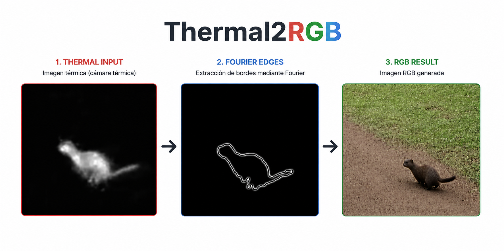
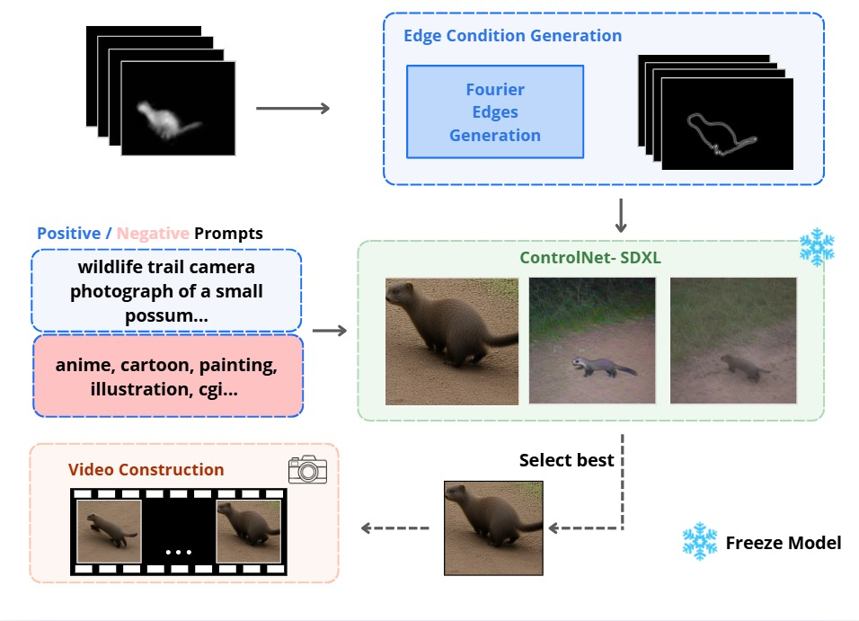
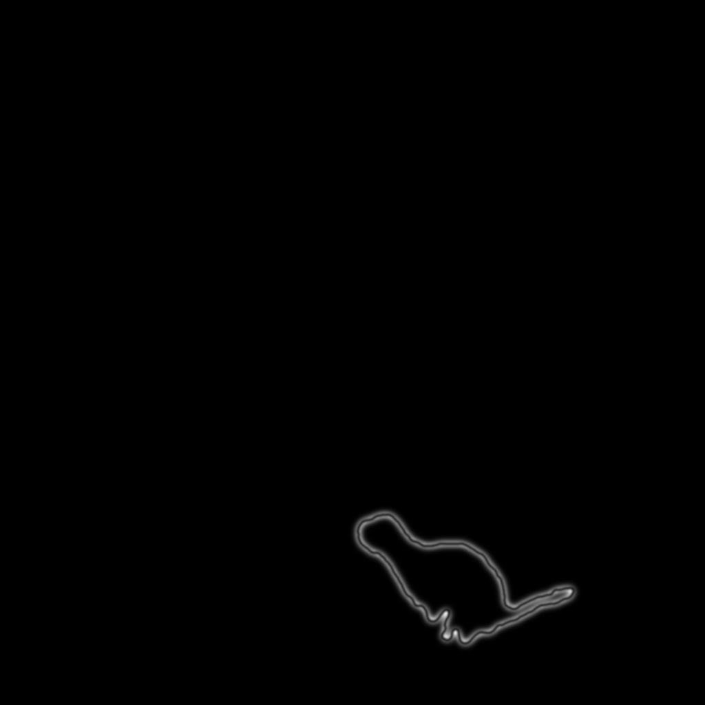
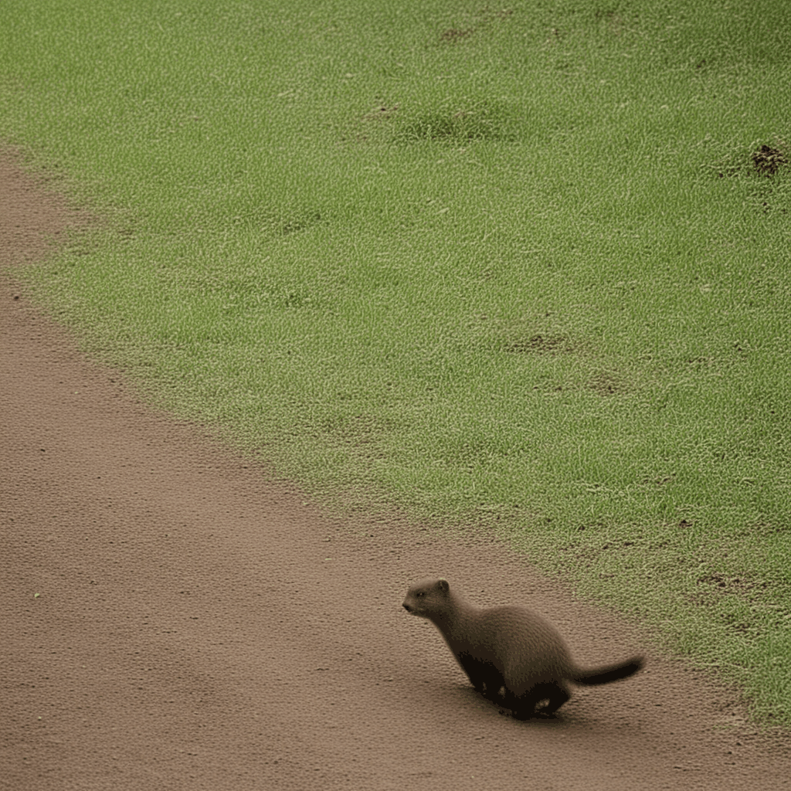
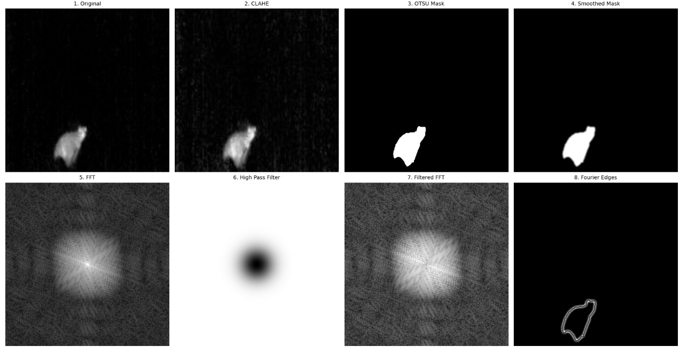

<div align="center">

# Thermal2RGB - Fourier


### Generación de imágenes RGB a partir de videos térmicos utilizando Fourier.


<br>

[Jeferson Acevedo](https://github.com/Jeferson0809) • [Brayan Quintero](https://github.com/BrayanQuintero123) • [Juan Paipa] •  [Juan Herrera]

---

Video de prueba de repo: https://youtu.be/IKOEgehN9no

---

</div>

La generación de imágenes RGB a partir de cámaras térmicas es un problema relevante en visión por computador, especialmente en escenarios nocturnos, vigilancia, wildlife monitoring y percepción multimodal.

Este proyecto propone un pipeline de **Thermal-to-RGB** basado en extracción de bordes mediante Fourier y modelos generativos basados en difusión. La información estructural de las imágenes térmicas es utilizada como guía para modelos SDXL condicionados con ControlNet, permitiendo generar imágenes RGB coherentes y visualmente realistas.

Además, se incorpora consistencia temporal utilizando IP-Adapter para mejorar la estabilidad entre frames consecutivos en secuencias de video.

> **Objetivo:** Utilizar información estructural obtenida en el dominio de Fourier para guiar modelos generativos y transformar videos térmicos en secuencias RGB coherentes.


---

# Arquitectura



---

# Pipeline

```text
Thermal Video
      ↓
CLAHE Enhancement
      ↓
OTSU Segmentation
      ↓
Gaussian Smoothing
      ↓
FFT Transformation
      ↓
High-Pass Fourier Filter
      ↓
Fourier Edge Extraction
      ↓
ControlNet Conditioning
      ↓
SDXL RGB Generation
      ↓
IP-Adapter Temporal Consistency
      ↓
Final RGB Video

```

# Resultados

<div align="center">

| Fourier Edge Extraction | RGB Generation |
|---|---|
|  |  |

</div>

---


---

# Estructura del repositorio

- `dataset/` — Videos térmicos utilizados para pruebas y generación obtenidos de https://lila.science/datasets/new-zealand-wildlife-thermal-imaging/
- `assets/` — GIFs y visualizaciones de resultados.
- `outputs/` — Resultados generados por el pipeline.
- `src/` — Implementación principal del pipeline Thermal-to-RGB.
  - `edgesfourier.py` — Extracción de bordes mediante Fourier.
  - `thermal2rgb.py` — Pipeline completo de generación RGB para videos.
  - `thermal2rgb2.py` — Pipeline completo de generación RGB para imagenes.
- `README.md` — Documentación principal del proyecto.

---

# Fourier Edge Extraction

La etapa de preprocessing utiliza técnicas de procesamiento de imágenes para extraer información estructural desde imágenes térmicas.



## Etapas principales

1. CLAHE para mejora de contraste.
2. Segmentación automática mediante OTSU.
3. Suavizado Gaussiano.
4. Transformada rápida de Fourier (FFT).
5. Filtro High-Pass Gaussiano.
6. Reconstrucción mediante Inverse FFT.
7. Normalización y generación de mapas de bordes.

Estos mapas son utilizados posteriormente como condición estructural para ControlNet.

---

# Modelos utilizados

## Generación RGB
- SDXL
- RealVisXL V4.0

## ControlNet
- SoftEdge DexiNed

## Consistencia temporal
- IP-Adapter SDXL

---

# Uso

## Thermal-to-RGB Pipeline

El script principal ejecuta automáticamente todo el pipeline:

- Preprocesamiento térmico
- CLAHE enhancement
- OTSU segmentation
- Fourier edge extraction
- ControlNet conditioning
- SDXL RGB generation
- IP-Adapter temporal consistency

```bash
python src/thermal2rgb.py
```

---

## Modelos utilizados

Durante la ejecución, el pipeline descarga automáticamente:

- RealVisXL V4.0
- SDXL ControlNet SoftEdge
- IP-Adapter SDXL

---

## Selección de frame referencia

Después de generar los primeros resultados RGB, el usuario debe seleccionar manualmente el frame con mejor calidad visual:

```text
[0] rgb_00000.png
[1] rgb_00001.png
...
```

Ese frame será utilizado por IP-Adapter como referencia visual para mejorar la consistencia temporal entre frames consecutivos.

---

## Fourier Visualization

El script `edgesfourier.py` permite visualizar el proceso completo de extracción de bordes mediante Fourier:

```bash
python src/edgesfourier.py
```

Incluye:

- FFT visualization
- High-pass filtering
- Inverse FFT reconstruction
- Edge extraction pipeline

---

# Salidas generadas

El pipeline genera automáticamente:

```bash
outputs/
│
├── thermal/
│   ├── thermal_00000.png
│   └── ...
│
├── fourier/
│   ├── fourier_00000.png
│   └── ...
│
├── rgb/
│   ├── rgb_00000.png
│   └── ...
│
├── rgb_consistent/
│   ├── consistent_00000.png
│   └── ...
│
├── consistent_video.mp4
└── config.txt
```

### thermal/
Frames térmicos procesados mediante CLAHE y denoising.

### fourier/
Mapas de bordes generados mediante Fourier High-Pass Filtering.

### rgb/
Primera generación RGB usando SDXL + ControlNet.

### rgb_consistent/
Frames refinados utilizando IP-Adapter para consistencia temporal.


---

# Requisitos de hardware

El pipeline utiliza modelos generativos basados en difusión de alta complejidad, incluyendo:

- SDXL
- ControlNet
- IP-Adapter

Por esta razón, se recomienda utilizar una GPU NVIDIA con soporte CUDA.

## Recomendado

- NVIDIA GPU con soporte CUDA
- 8GB+ VRAM recomendado
- 16GB+ RAM del sistema
- Python 3.10+

## Probado en

- NVIDIA RTX PRO 6000 Blackwell
- CUDA 12+
- PyTorch 2.6

---

# Instalación

Clonar el repositorio:

```bash
git clone https://github.com/Jeferson0809/Thermal2RGB.git

cd Thermal2RGB
```

Crear entorno virtual:

```bash
python -m venv venv
```

Activar entorno virtual:

## Windows

```bash
venv\Scripts\activate
```

## Linux / MacOS

```bash
source venv/bin/activate
```

---

# Instalación de PyTorch con CUDA

Instalar PyTorch con soporte CUDA desde:

https://pytorch.org/get-started/locally/

Ejemplo:

```bash
pip install torch torchvision torchaudio --index-url https://download.pytorch.org/whl/cu124
```

---

# Dependencias

Instalar dependencias restantes:

```bash
pip install -r requirements.txt
```

---

# Primera ejecución

Durante la primera ejecución, los modelos serán descargados automáticamente desde HuggingFace.

Esto incluye:

- RealVisXL V4.0
- SDXL ControlNet SoftEdge
- IP-Adapter SDXL

La descarga inicial puede tardar varios minutos dependiendo de la conexión a internet.

---

# Papers y referencias utilizadas

## ControlNet

Zhang et al. — *Adding Conditional Control to Text-to-Image Diffusion Models*

https://arxiv.org/abs/2302.05543

---

## Stable Diffusion XL (SDXL)

Podell et al. — *SDXL: Improving Latent Diffusion Models for High-Resolution Image Synthesis*

https://arxiv.org/abs/2307.01952

---

## Latent Diffusion Models

Rombach et al. — *High-Resolution Image Synthesis with Latent Diffusion Models*

https://arxiv.org/abs/2112.10752

---

## IP-Adapter

Ye et al. — *IP-Adapter: Text Compatible Image Prompt Adapter for Text-to-Image Diffusion Models*

https://arxiv.org/abs/2308.06721

---

# Limitaciones

Debido al uso de SDXL y ControlNet, GPUs con baja VRAM pueden presentar errores de memoria durante la carga o generación de imágenes.

Para GPUs limitadas, se recomienda:

- Reducir resolución de generación
- Reducir número de inference steps
- Reducir cantidad de frames procesados

Ejemplo:

```python
WIDTH  = 512
HEIGHT = 512

NUM_INFERENCE_STEPS = 20

MAX_FRAMES = 4
```

---

# Trabajo futuro

- Video diffusion models
- Temporal attention mechanisms
- Real-time inference
- Optical flow stabilization
- Fine-tuning especializado para imágenes térmicas
- Multi-frame conditioning
- Fourier-conditioned diffusion architectures

---

# Licencia

MIT License
